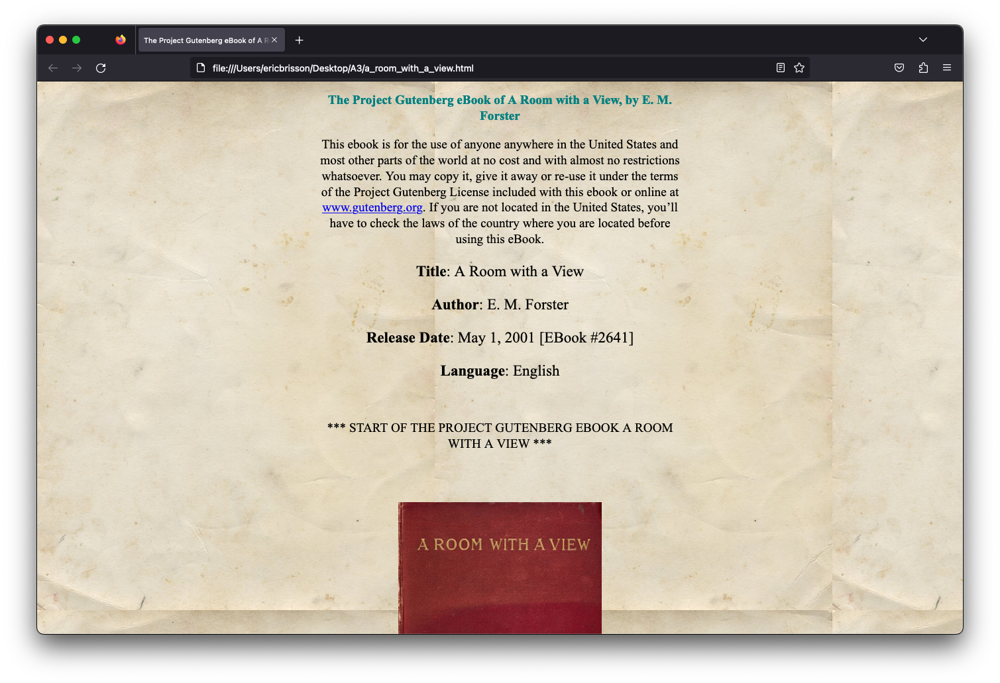
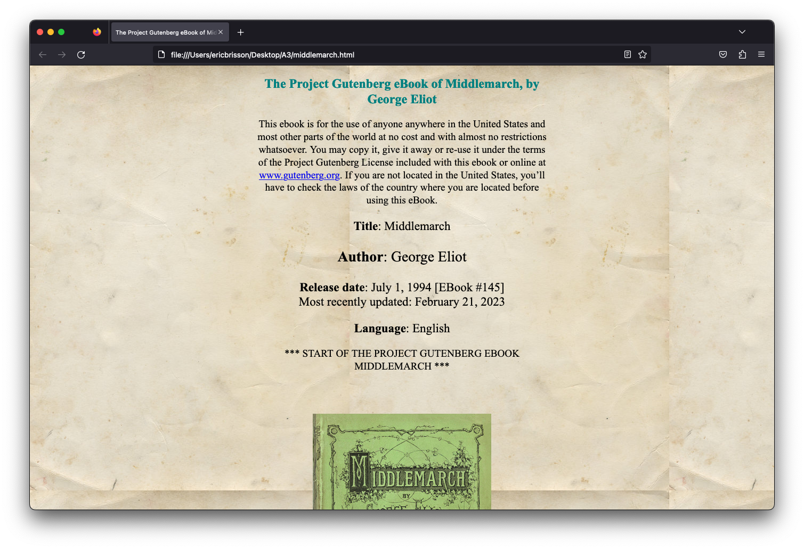
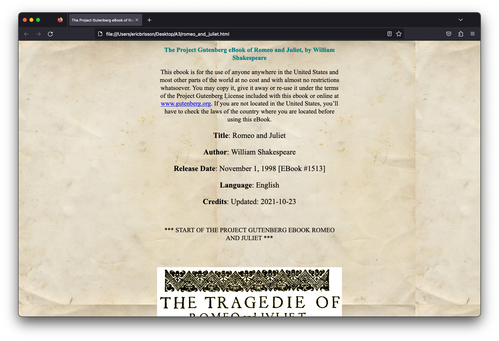

Assignment: CSS Hell
====================

You will skin 3 project gutenberg stories with custom CSS.

You will skin 2 versions of a possible professional homepage for your
self with 2 versions of CSS.

Read requirements.org

Read this comic http://theoatmeal.com/comics/design_hell

git clone https://github.com/abramhindle/CMPUT404-assignment-css-hell.git

License/Copyright
=================

Textual content is copyright Abram Hindle (C) 2013 under the CC-BY-SA
4.0 unported license. Attribution should be a hyperlink to the
repository and (C) 2013 Abram Hindle visibile in the text.

Code is licensed under the Apache 2.0 license.

See file `LICENSE` for code license.

Part 1) Notes
=================
### Books chosen:
- [A Room with a View](https://www.gutenberg.org/ebooks/2641)
- [Middlemarch](https://www.gutenberg.org/ebooks/145)
- [Romeo and Juliet](https://www.gutenberg.org/ebooks/1513)
---
### CSS applied:
- paragraphs are themed with a Times New Roman font, 1.2em font size, normal font weight, and a black font color
- divs are also themed the same way as paragraphs, as some of the book `.html` files had text inside of divs with no `<p>` tags
- all headers (`h1` through `h6`) are themed with a Times New Roman font, a bold font weight, and a teal font color
- the HTML body has a background color of #f0e0c6 (yellow-ish), a repeating old paper background, a margin of 30% on the left and right, and has everything centered (using text-align)
- an additional class had a CSS rule written, `fig` because all the book `.html` files had their cover image sitting inside a `div` with the class name `fig`. I wanted to center the book cover along with all the other content on the page, so I gave some margin, text-align, and display rules to this class.

---
### Changes made to the `.html` files
- to all three book's `.html` files, I removed all `<style>` tags to give myself a clean slate, and then added the following right before the closing `</head> tag, to import my CSS file:
```
<!-- import book.css -->
<link rel="stylesheet" href="book.css" type="text/css" />
```

- additionally, `middlemarch.html` for some reason was missing the inline styling that my other `.html` book files used for the table of contents, so that was added inline just to keep things consistent:
```
...
<h2>Contents</h2>
    <table style="margin-left: auto; margin-right: auto">
        <tbody>
...
```

- furthermore, all image book cover's `href` attributes were modified just to point to the correct file name in the root of this folder in each book's `.html` file, to `<BOOK_TITLE>_cover.jpg`.

---
### Screenshots
__A Room with a View:__


__Middlemarch:__


__Romeo and Juliet:__


### Sources
Old paper image source: [https://i.stack.imgur.com/kb0Zm.jpg](https://i.stack.imgur.com/kb0Zm.jpg)
Books covers taken from linked ebook listings above.

Part 2) Notes
=================
Used Google Fonts. Links provided in both `homepage/good.css` and `homepage/bad.css`.

### Screenshots
__"Nice" Site:__


__"Ugly" Site:__


